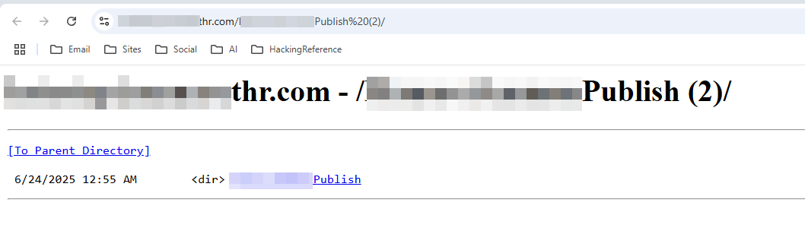
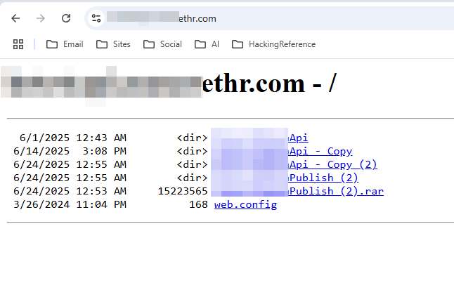
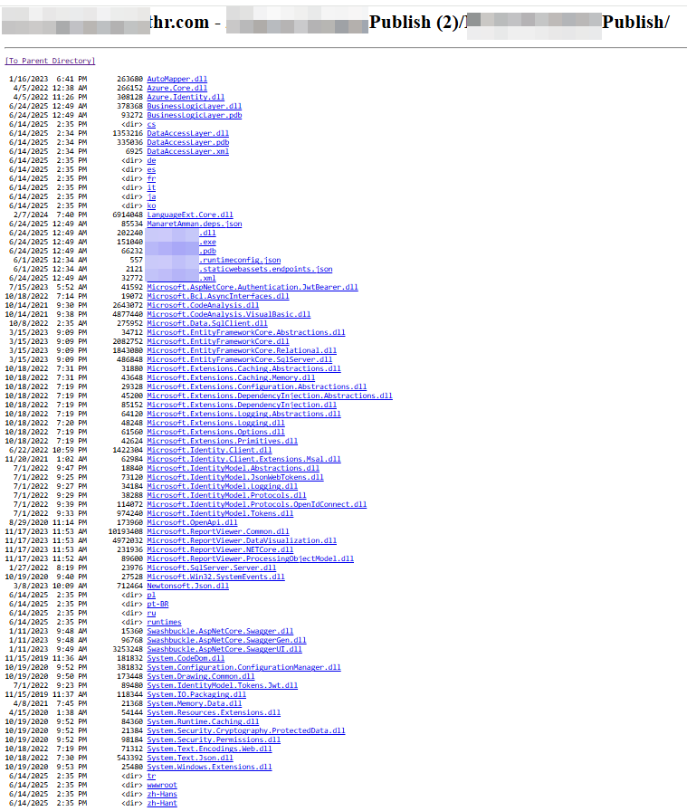
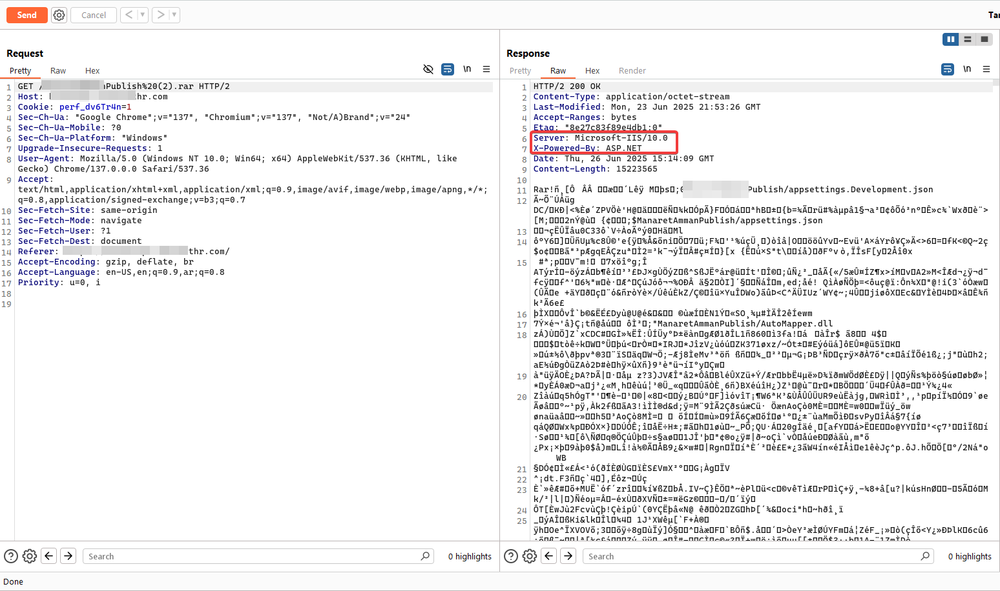
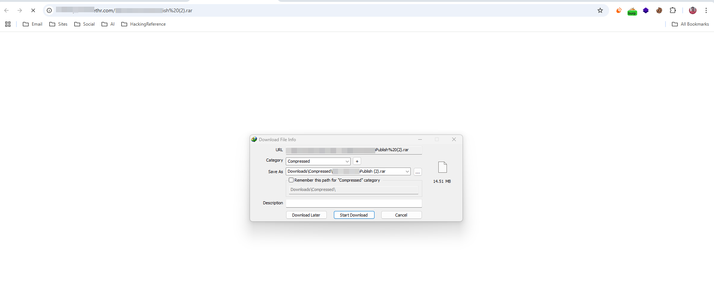
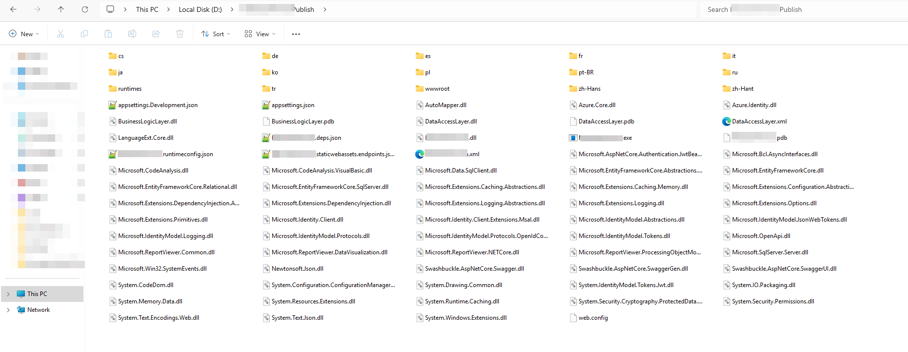
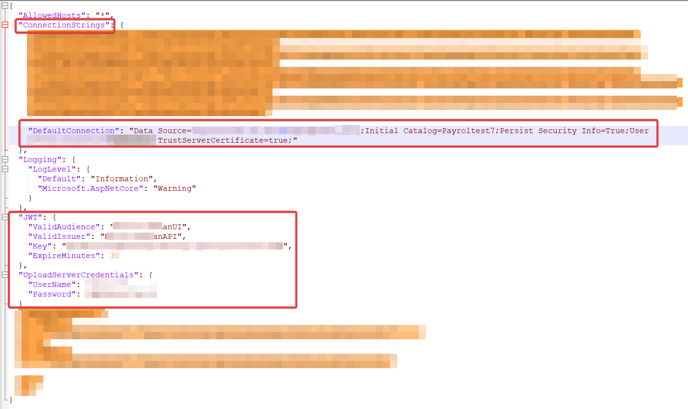

# 🛡️ Sensitive Publish Folder Disclosure – Full Application Compromise

This is a report of a **critical security vulnerability** that exposed highly sensitive files on a public-facing web server and led to full compromise of the application and its database.

---

## 🎯 Target

For confidentiality, I’ll refer to the website as:

**`targetwebsite.com`**

I was invited to test some internal features related to employee functionality. During the testing process, I found something extremely dangerous.

---

## 🔍 Initial Discovery

While inspecting network requests using **Burp Suite** and browser devtools, I discovered that the website’s **`publish` folder was publicly accessible**, including all its internal contents.

---

## 📂 Directory Browsing Enabled

Navigating to the folder revealed full directory listing enabled, which allowed access to DLLs, config files, and sensitive components.

---

## 🧱 Folder Contents

Upon browsing, I found the compiled `.dll` files, `.json` config files, and more.

---

## 📥 Compressed Folder Available

The server (running **IIS**) allowed me to directly download a compressed version of the entire folder.

Using Burp Suite, I downloaded the entire compressed `publish` folder.

---

## 🧩 Extracting Hidden Files

Once extracted, the archive contained even **more files** than were visible through the browser, including debugging symbols and sensitive configs.

---

## 🔐 Sensitive File Found – `appsettings.json`

One of the most dangerous discoveries was the presence of:

### `appsettings.json`

This file typically contains:
- ✅ **Database connection strings** (including IPs, usernames, passwords)
- ✅ **JWT secret key**, which allows token forging → **Authentication Bypass**
- ✅ **OAuth API keys** (Google, Facebook login credentials)
- ⚠️ Potential SMTP or third-party integration secrets

---

## 📚 Learn More About `appsettings.json`

- 📖 [Microsoft Docs – ASP.NET Core Configuration](https://learn.microsoft.com/en-us/aspnet/core/fundamentals/configuration/?view=aspnetcore-9.0)
- ✍️ [Medium: The Complete Guide to appsettings.json in .NET Core](https://mvineetsharma.medium.com/understanding-appsettings-json-in-net-core-the-complete-guide-5f634ba7c57d)

---

## 🚨 Impact Summary

| Affected Area          | Severity |
|------------------------|----------|
| Database Access        | 🔥 Critical |
| JWT Forging            | 🔥 Critical |
| OAuth Key Disclosure   | ⚠️ High |
| Internal Logic Leakage | ⚠️ High |
| Source Code Disclosure | ⚠️ High |

---

## ✅ Disclosure Status

I immediately reported the issue to the website owner.  
They acknowledged the issue and confirmed they were working on a fix.

---

## 🧠 Recommendations

- ❌ Never deploy `appsettings.json` or secrets to public environments
- ✅ Use **environment variables** or **Key Vaults**
- ✅ Disable **directory browsing** on production servers
- ✅ Regularly review exposed static paths in production
- ✅ Always test deployments in staging before release

---

## 🙋‍♂️ Author

- [💼 LinkedIn](https://www.linkedin.com/in/yo00unis)  
- [🐙 GitHub](https://github.com/yo00unis)  
- [🐦 Twitter / X](https://x.com/yo00unis)

---

> ⚠️ **Impact: CRITICAL**  
> This vulnerability allowed full access to sensitive configuration files and authentication systems.
