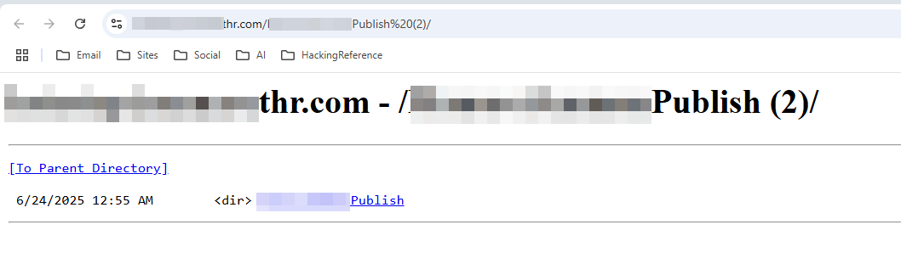
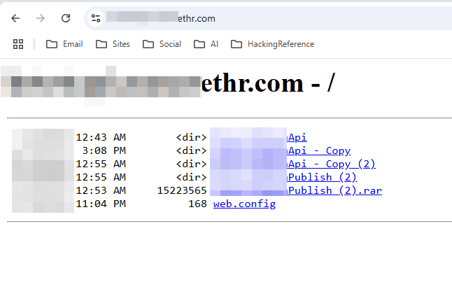
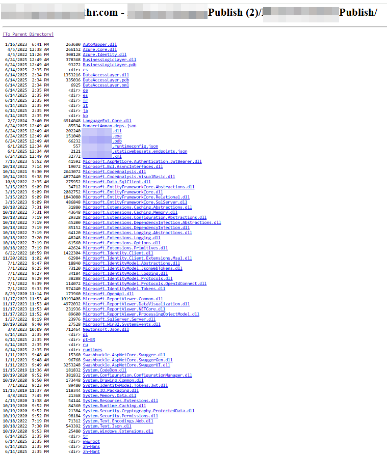
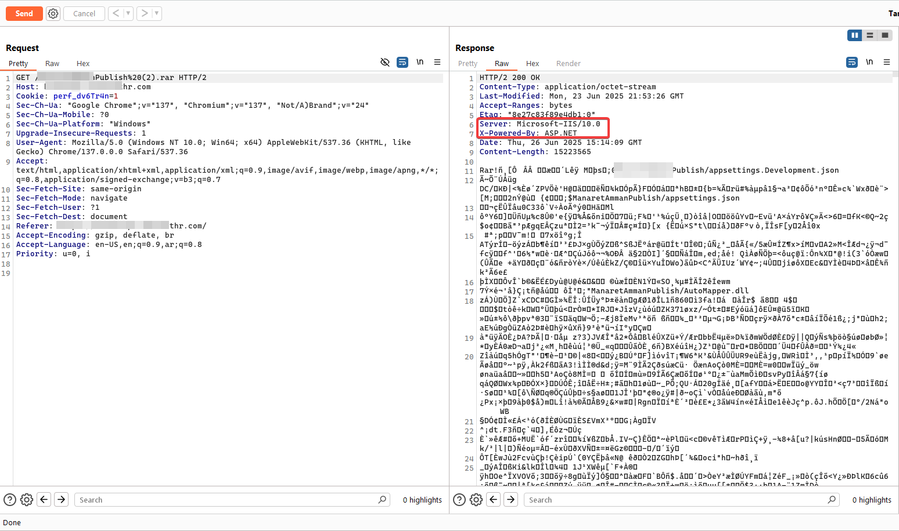
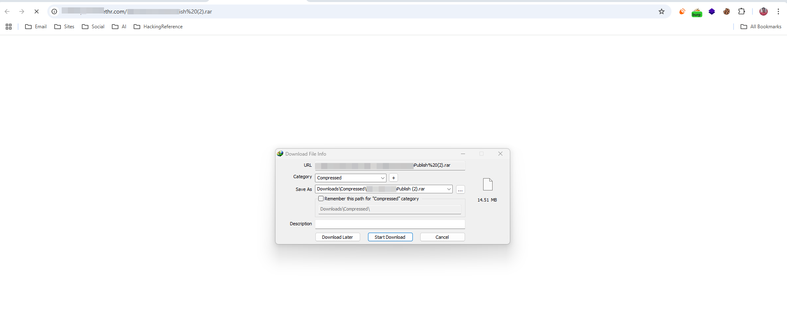
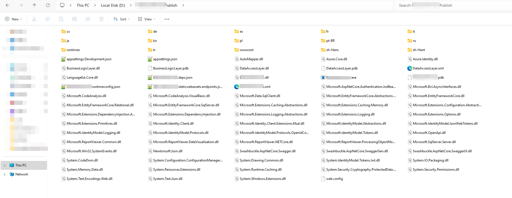
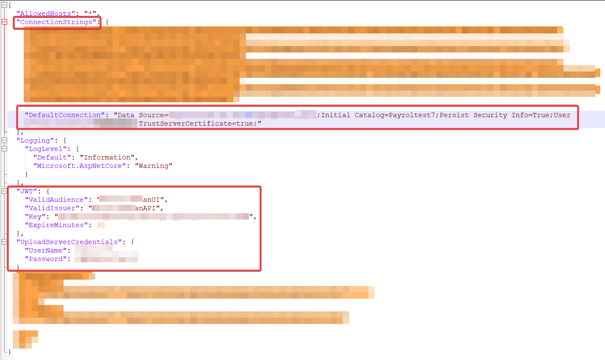
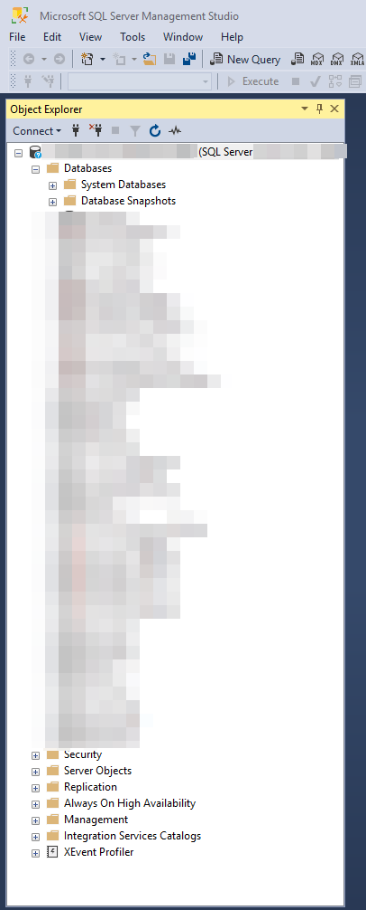

# 🛡️ Sensitive Publish Folder Disclosure – Full Application Compromise

This report describes a **critical security vulnerability** that exposed highly sensitive files on a public‑facing web server and ultimately allowed **full compromise of the application and its database**.

---

## 🎯 Target

For confidentiality, the affected domain is referenced as **`targetwebsite.com`**.

I was invited to test several internal employee‑related features. During that engagement I uncovered a severe misconfiguration.

---

## 🔍 Initial Discovery

While inspecting network requests with **Burp Suite** and the browser dev‑tools, I noticed that the application’s **`publish` folder was publicly accessible**, including all of its contents.

---

## 📂 Directory Browsing Enabled

Directory browsing was enabled, exposing DLLs, configuration files, and other sensitive components.

---

## 🧱 Folder Contents

Among the exposed files were compiled **`.dll`** assemblies, **`.json`** configuration files, and more.

---

## 📥 Compressed Folder Available

The web server (Microsoft **IIS**) even offered a compressed archive of the entire folder.

Using **Internet Download Manager (IDM)** I retrieved the archive:

---

## 🧩 Extracting Hidden Files

After extracting the archive with **WinRAR**, I found additional files that were not visible through the browser, including debug symbols and further configuration files.

---

## 🔐 Sensitive File Found – `appsettings.json`

The most dangerous file was undoubtedly **`appsettings.json`**.

This file contained:

- **Database connection strings** (server address, username, password).  
- **JWT secret key**, allowing the creation of arbitrary tokens → *authentication bypass & privilege escalation*.  
- **OAuth client secrets** (Google, Facebook, …).  
- Possible **SMTP** or other third‑party service keys.

---

## 📚 Further Reading on `appsettings.json`

- 📖 [Microsoft Docs – ASP.NET Core Configuration](https://learn.microsoft.com/en-us/aspnet/core/fundamentals/configuration/?view=aspnetcore-9.0)  
- ✍️ [Medium – The Complete Guide to `appsettings.json` in .NET Core](https://mvineetsharma.medium.com/understanding-appsettings-json-in-net-core-the-complete-guide-5f634ba7c57d)

---

## 🗄️ Successful Database Login

Using the leaked connection string I established a successful connection to the production SQL Server instance via **SSMS**:

---

## 🚨 Impact Summary

| Affected Area            | Severity |
| ------------------------ | -------- |
| Database access          | 🔥 **Critical** |
| JWT forging              | 🔥 **Critical** |
| OAuth key disclosure     | ⚠️ High |
| Internal logic leakage   | ⚠️ High |
| Source code disclosure   | ⚠️ High |

---

## ✅ Disclosure Status

The vulnerability was reported immediately to the website owner.  
They acknowledged the report and confirmed that mitigation is in progress.

---

## 🧠 Recommendations

- **Never** deploy `appsettings.json` (or any secret) to a public environment.  
- Use **environment variables** or a dedicated **secrets‑management service** (e.g., Azure Key Vault).  
- Disable **directory browsing** on production servers.  
- Review exposed static paths as part of every deployment pipeline.  
- Validate all releases in a staging environment before pushing to production.

---

## 🙋‍♂️ Author

- 💼 [LinkedIn](https://www.linkedin.com/in/yo00unis)  
- 🐙 [GitHub](https://github.com/yo00unis)  
- 🐦 [Twitter / X](https://x.com/yo00unis)

---

> ⚠️ **Overall Impact: CRITICAL**  
> Leaked configuration and secret keys allowed full compromise of the application and underlying data.
